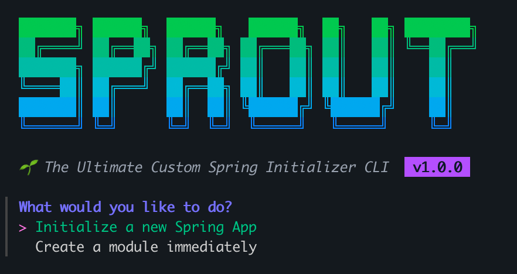
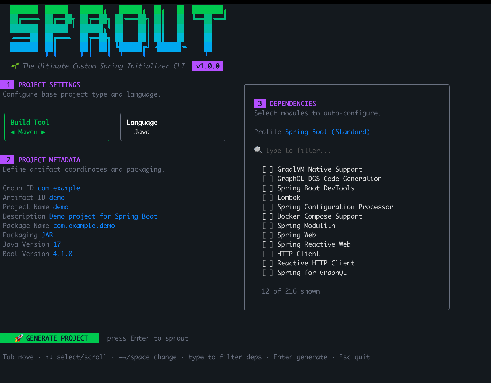
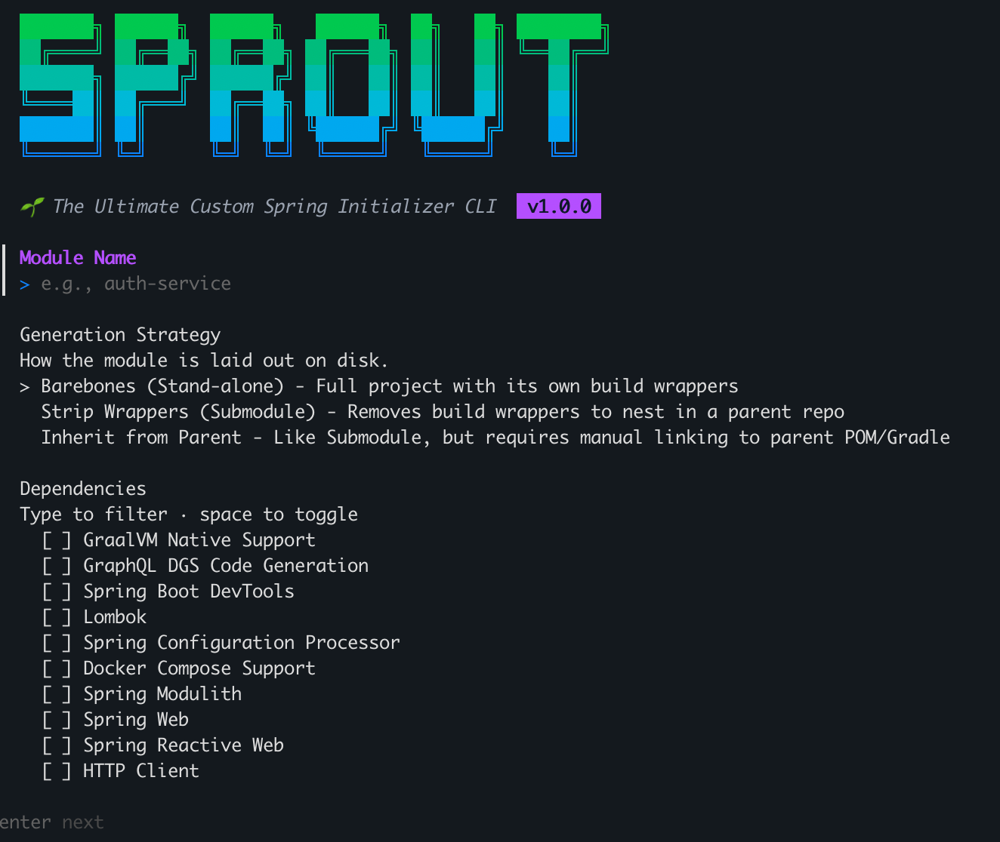

```text
  ███████╗ ██████╗  ██████╗   ██████╗  ██╗   ██╗ ████████╗
  ██╔════╝ ██╔══██╗ ██╔══██╗ ██╔═══██╗ ██║   ██║ ╚══██╔══╝
  ███████╗ ██████╔╝ ██████╔╝ ██║   ██║ ██║   ██║    ██║   
  ╚════██║ ██╔═══╝  ██╔══██╗ ██║   ██║ ██║   ██║    ██║   
  ███████║ ██║      ██║  ██║ ╚██████╔╝ ╚██████╔╝    ██║   
  ╚══════╝ ╚═╝      ╚═╝  ╚═╝  ╚═════╝   ╚═════╝     ╚═╝   
```

# 🌱 Sprout - The Custom Spring Initializer

[](https://github.com/jessn-dev/sprout)
[](https://github.com/jessn-dev/sprout/releases)
[](https://github.com/jessn-dev/sprout/actions)
[](https://github.com/jessn-dev/sprout/blob/main/LICENSE)

Hey there! 👋 Welcome to **Sprout**.

If you've ever started a Spring Boot project, you know the drill: head to `start.spring.io`, pick your dependencies, download the zip, extract it, and *then* spend the next hour configuring Docker, Redis, databases, and writing boilerplate.

I built Sprout because I was tired of doing that over and over again. I wanted a tool that didn't just grab the raw Spring dependencies, but instantly injected my own opinionated templates (like a pre-configured `docker-compose.yml`, custom database configs, and standard security setups) right into the generated codebase. 

But beyond just fixing my Spring Boot workflow, **I really built this to learn Go.** I wanted to dive into building modern, fast, and beautiful terminal applications, and I wanted to put everything I learned into a project that I could share with all of you.

### 🤔 Why use Sprout over the official CLI?
The official Spring CLI is great, but it leaves you hanging when it comes to the "glue" code and architectural best practices. 

With Sprout, you get a fast terminal UI that asks you what you need. Then, it:
1. Hits the Spring Initializr API to get the base project.
2. Extracts it locally.
3. **Automatically injects Enterprise Architecture**: 
   - Scaffolds a full standard Java package tree (`web`, `service`, `domain`, `repository`, etc.).
   - Dynamically enables Virtual Threads (`spring.threads.virtual.enabled=true`) for Java 21+.
   - Injects `springdoc-openapi` into your build file for instant Swagger documentation.
   - Wires up Testcontainers and JUnit dependencies automatically if you select a database.
4. **Bootstraps Production-Ready DevOps**:
   - Generates non-root Docker multi-stage builds.
   - Generates Kubernetes manifests (`deployment.yaml`, `service.yaml`) with Liveness/Readiness actuator probes.
   - Creates a GitHub Actions CI pipeline (`build.yml`).
   - Splits configuration into safe prod defaults and verbose dev overrides.

### 🚀 Getting Started

**Installation**

*For macOS / Linux (Homebrew):*
```bash
brew install jessn-dev/tap/sprout
```

*For Go Developers:*
```bash
go install github.com/jessn-dev/sprout/cmd/sprout@latest
```
*(Or grab the latest binary from the [Releases](https://github.com/jessn-dev/sprout/releases) page!)*

**Usage**

Sprout offers several commands depending on what you need:

1. **The Main Setup (`sprout`)**
   
   Just run `sprout` in your terminal. This opens the main TUI where you can set up your project metadata and search through live Spring Boot dependencies. You can generate a full application or just a standalone module (it even has options to strip out `mvnw`/`gradlew` so it nests cleanly into your existing repo).

2. **⚡️ Accelerated Setup With Quick Interactivity (`sprout quick`)**
   
   If you just need a standard project *right now* and don't want to dig through menus, this is your command. It asks you for a project name and what type of template you want (Standard, Cloud, or Security) and immediately generates the project using standard sensible defaults (Java 21, Gradle, Latest Boot Version).
   ```bash
   sprout quick
   ```

3. **🧭 Discoverability and Exploration (`sprout explore`)**
   
   Navigating the Spring ecosystem can be overwhelming for new devs. This command helps you explore the ecosystem without leaving your terminal. It opens a terminal browser where you can search, read descriptions, and view explanations for every single dependency available on `start.spring.io`.
   ```bash
   sprout explore
   ```

4. **🤖 Non-Interactive / CI (`sprout new`)**
   Fully flag-driven, no prompts — perfect for scripts and CI:
   ```bash
   sprout new --name shop-api --group com.acme --deps web,data-jpa,docker --git
   sprout new --name api --type security --java 21
   ```
   Run `sprout new --help` for every flag. Coordinates are validated up front, so you get a clear error instead of an opaque Initializr `400`.

5. **Shell Autocompletion (`sprout completion`)**
   Sprout supports native autocompletion for Bash, Zsh, Fish, and PowerShell. 
   ```bash
   sprout completion zsh > /usr/local/share/zsh/site-functions/_sprout
   ```

Check your installed version any time with `sprout --version`.

### 🏃‍♂️ Running your Generated App

Because Sprout injects Enterprise Architecture and DevOps configs out-of-the-box, running your new app is incredibly simple:

**1. Start the dependencies (if you selected a DB/Redis/Kafka):**
```bash
docker-compose up -d
```

**2. Boot the Spring App:**
```bash
# If you chose Gradle
./gradlew bootRun

# If you chose Maven
./mvnw spring-boot:run
```

**3. Test the built-in Health & Swagger Endpoints:**
```bash
curl http://localhost:8080/actuator/health
curl http://localhost:8080/v3/api-docs
```

### 🤝 Let's Build This Together
I originally built Sprout to solve my own annoying workflow problems, but honestly? It was also my excuse to dive deep into **Go**. I wanted to learn how to build robust, beautiful CLIs with tools like Bubbletea, and I wanted to put those learnings out there to share with the community. 

If you're learning Go, feel free to poke around the codebase! And if you're a Java developer who has a better way of setting up Neo4j, RabbitMQ, Spring Security, or you want to add templates for your own tools, **please contribute!** Fork the repo, add your injection templates in `internal/generator`, and submit a PR. 

Let's spend less time writing boilerplate and more time building the actual app. Happy sprouting! 🌱
